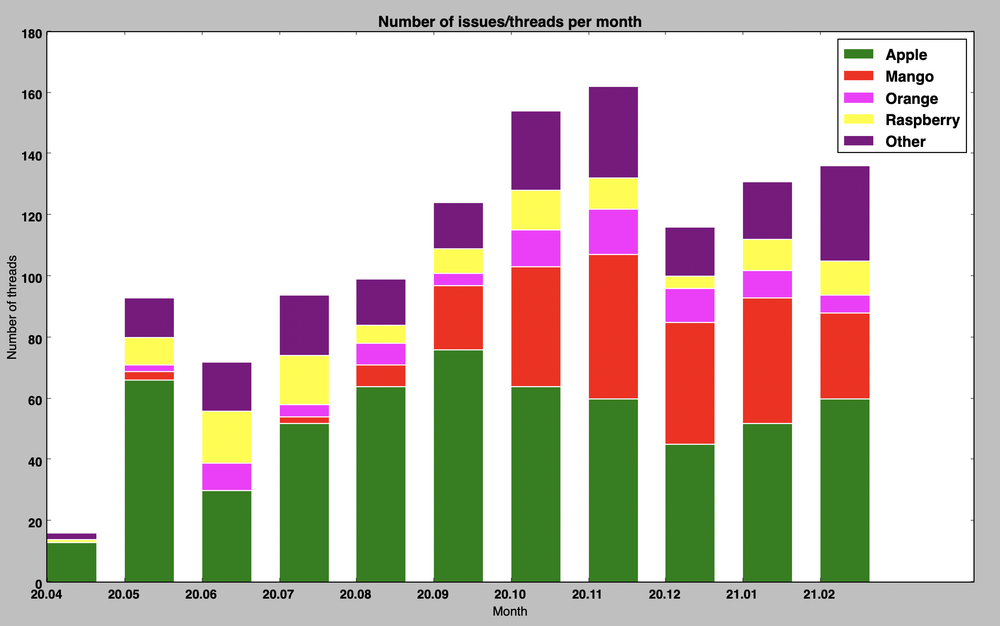

# Slack channel history analyzer
Analyze Slack channel history by counting threads with specified keywords.

This small project contains two Python scripts:
1. fetchHistory.py - fetches a Slack channel history and saves it to a json file.
2. analyzeHistory.py - counts threads with specified keywords, aggregates those threads per month and renders them on a chart.

## Example analyze

Example Slack channel history analyze with threads containing keywords such as Apple, Mango, Orange, etc.



## Requirements

* Python 3.7+
* python3 -m pip install -r requirements.txt
* Token from [a Slack Application](https://api.slack.com/apps) with `channels.history` scope.
  You can create the Slack Application to get this token, but then you need to install the App in the channel which you want to analyze.

## How to run

### Fetch history

```bash
python3 ./fetchHistory.py -token {token} -channel {channelID} 
```
Where:

- {token} is a token from Slack App with permission to read channel history.
  With this token you should be able to run the following [test method](https://api.slack.com/methods/conversations.history/test).
- {ChannelID} you can get from URL of Slack Web Client. 

### Analyze history

```bash
python3 ./analyzeHistory.py -threads '[{"name": "Apple", "keywords": ["apple", "green"], "color": "#008000", "debug": false}, {"name": "Mango", "keywords": ["mango", "yellow"], "color": "#FF0000"}]'
```
`-threads` parameter is a JSON list in which every element has to have `name` and `keywords` fields.
`name` is a thread name and `keywords` is a list of words which represent the thread.
If a Slack channel thread contains specified keyword, then counter of the corresponding thread is incremented.
The configuration from above command means that if in a Slack thread there is a word `apple` or `green`,
then number of `Apple` threads is incremented.
